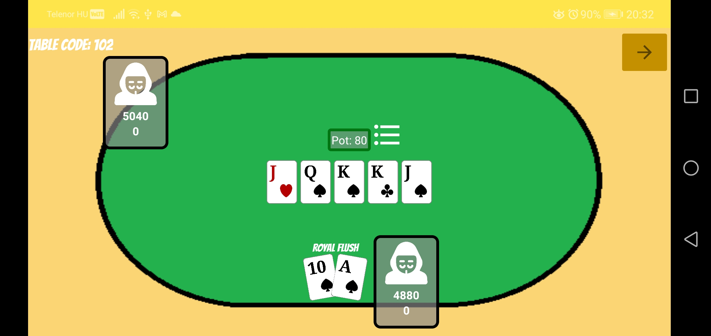
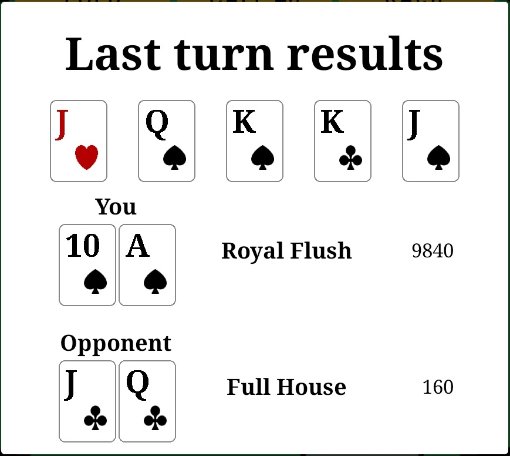
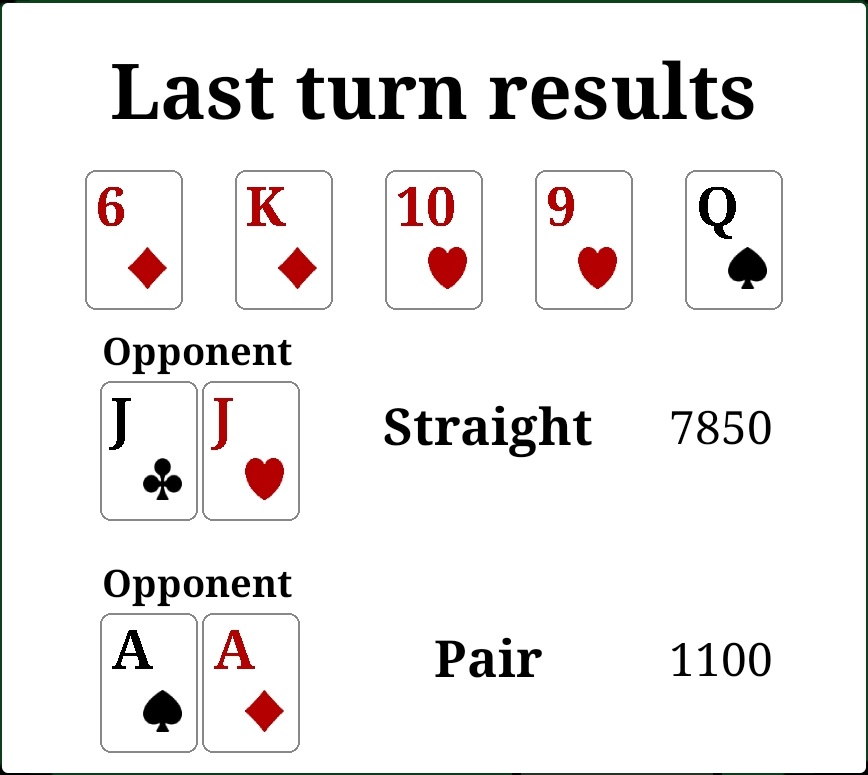
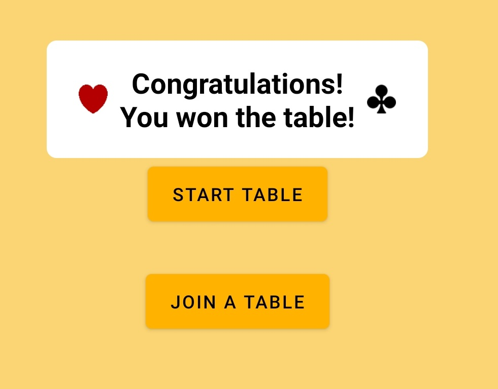

# Multiplayer Poker Game for Android

### Badges

# Screenshots

## Table

4 players with all types of actions  |  Having Royal Flush on board
:-------------------------:|:-------------------------:
  |  

## End of turn results

Royal Flush vs Full House  |  Straight vs Pocket Rockets
:-------------------------:|:-------------------------:
  |  

## Winning announcement

